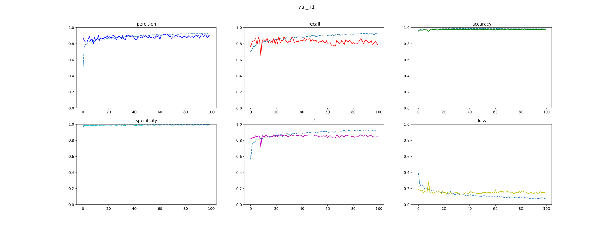
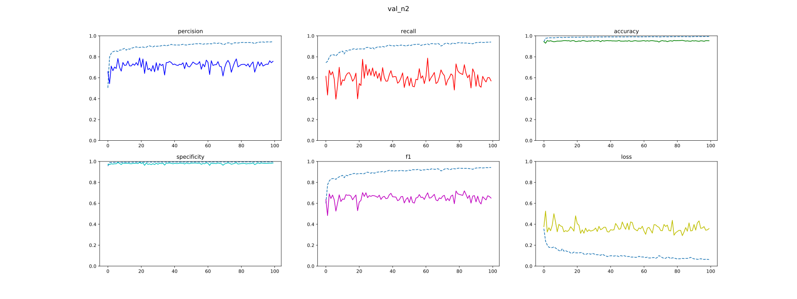
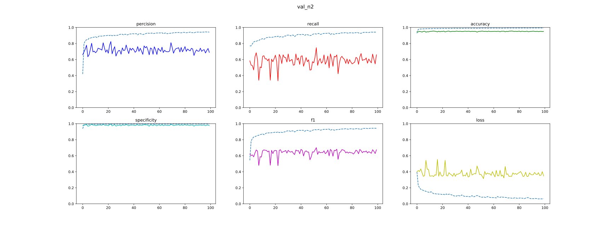
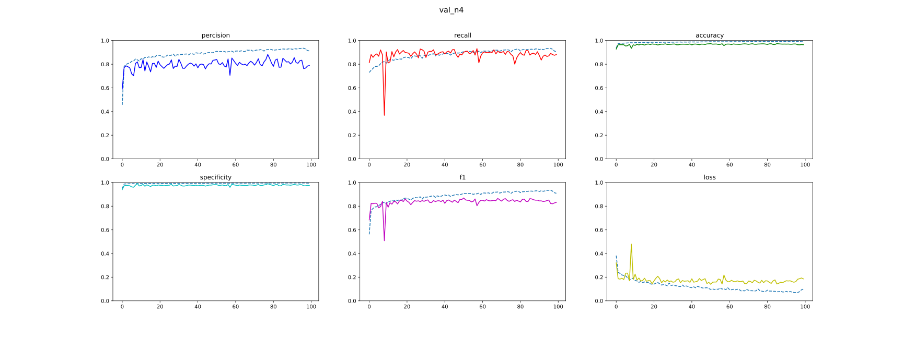
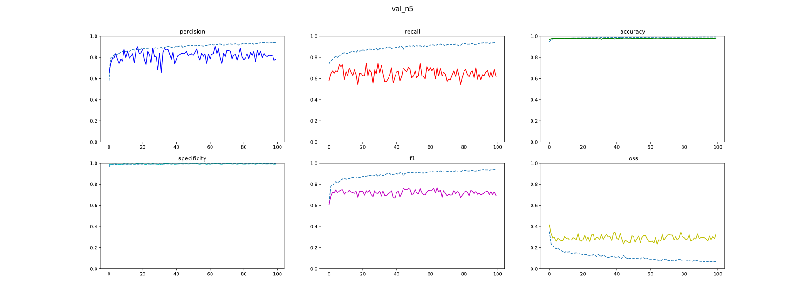

* origional unet, 100 epochs

lr = 0.001 | lr = 0.0001 | lr = 0.00001
------------ | ------------- | -------------
 |  |
 |  |
 |  |
 |  |
 |  |
große Schwankung | best Wahl | nicht konvergiert(dauert zu lange)

---

* Vergleichen von verschiedenen Modelle

original unet | multiout unet | fcn restnet50 | deeplabv3 resnet50
------------ | ------------- | ------------- | -------------
 |  | |
 |  | |
 |  | |
 |  | |
 |  | |

Y-Bereich von Restnet sind falsch, ich mache morgen neu. 
